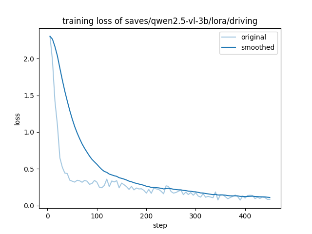

# driving-vlm-finetune

基于 **Qwen2.5-VL-3B** 的自动驾驶场景理解模型，使用 **LoRA + 4bit 量化（QLoRA）** 在 nuScenes 数据上微调，可对前置摄像头图像进行目标物体描述、计数和潜在风险分析。

## 效果

| 问题 | 模型回答 |
|------|----------|
| 请描述这个自动驾驶场景中的目标物体。 | 该场景中包含 3 辆轿车、1 名行人、2 个交通锥。 |
| 分析这个驾驶场景的潜在风险。 | 场景中存在行人，需注意避让。存在交通锥，可能有施工或事故区域。 |

## 技术栈

- **基座模型**：Qwen/Qwen2.5-VL-3B-Instruct
- **微调方法**：LoRA（rank=16，all linear layers）+ bitsandbytes 4bit 量化
- **训练框架**：LLaMA-Factory
- **数据集**：nuScenes v1.0-mini（前置摄像头）
- **推理界面**：Gradio
- **环境**：Python 3.11 / PyTorch 2.12 / CUDA 12.6

## 项目结构

```
driving-vlm-finetune/
├── scripts/
│   ├── prepare_sft_data.py   # 从 nuScenes 生成 ShareGPT 格式训练数据
│   └── inference.py          # 命令行推理
├── configs/
│   └── driving_sft.yaml      # LLaMA-Factory 训练配置
├── app.py                    # Gradio 推理界面
├── requirements.txt
└── training_loss.png         # 训练 loss 曲线
```

## 数据处理：核心难点

nuScenes 的原始 3D 标注是 **360° 全景**的，直接用来给前置摄像头图像打标签会导致「答案里有 42 辆车，画面里只有 10 辆」——标注和画面对不上，属于典型的 *Garbage In, Garbage Out*。

解决方案（见 `scripts/prepare_sft_data.py`）：

1. 用 `nuscenes-devkit` 的 `get_sample_data(box_vis_level=BoxVisibility.ANY)`，它内部完成 3D→2D 投影，只返回前置摄像头**视野内**的物体框；
2. 再用 `box.center` 模长做 **40 米距离过滤**，去掉远处看不清的物体；
3. 把标注映射成中文，自动生成「描述 / 风险 / 计数」三类问答对。

清洗后模型计数准确度和回答一致性显著提升。

## 快速开始

### 1. 安装依赖

```bash
conda create -n driving-vlm python=3.11
conda activate driving-vlm
pip install -r requirements.txt
```

LLaMA-Factory 需单独安装：

```bash
git clone https://github.com/hiyouga/LLaMA-Factory.git
cd LLaMA-Factory
pip install -e ".[torch,metrics]"
```

### 2. 生成训练数据

下载 nuScenes v1.0-mini 后，修改 `scripts/prepare_sft_data.py` 中的 `DATAROOT` 和 `IMG_ABS_ROOT`，然后：

```bash
python scripts/prepare_sft_data.py
```

把生成的 `data/sft/driving_sft.json` 注册到 LLaMA-Factory 的 `data/dataset_info.json`。

### 3. 训练

```bash
llamafactory-cli train configs/driving_sft.yaml
```

### 4. 推理

命令行：

```bash
python scripts/inference.py
```

Web 界面：

```bash
python app.py
```

## 训练细节

| 配置 | 值 |
|------|-----|
| LoRA rank | 16 |
| 量化 | 4bit (NF4, bitsandbytes) |
| batch size | 1 × 梯度累积 8 |
| learning rate | 2e-4，cosine 衰减 |
| epochs | 3 |
| 精度 | fp16 |



> 推理时采用 fp16 全精度加载基座模型 + LoRA adapter，避免 Windows 上 4bit 量化推理的数值不稳定问题（输出 `!!!!`）；并通过 `min_pixels/max_pixels` 限制图像分辨率控制显存。
